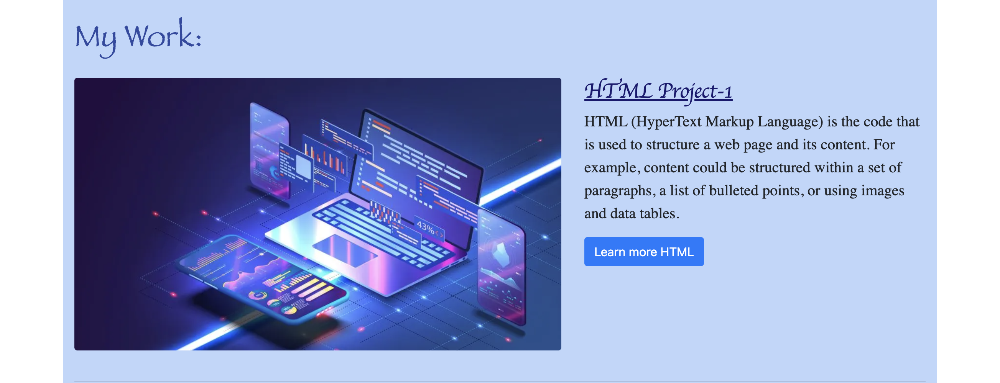

# UX and Advanced CSS: Bootstrap Portfolio
Challenge 3 : UX and Advanced CSS
My first Bootstrap portfolio. Personal portfolio page, created with Bootstrap elements.

# Project Requirements:
 * Create a new GitHub repository and name it Bootstrap-Portfolio.
  
 * Clone this repository to your computer.
  
 * Inside your Bootstrap-Portfolio repo, create the folder structure for the webpage.
   * Create a folder structure.
     * Create a index.html.
     * Create a css folder.
     * Inside create a style.css file.
   * Create an images folder.
     * Place all your images in this folder.
  
 * Using Bootstrap, recreate your portfolio site with the following items:
   * A navigation bar
   * A navigation menu at the top. Feel free to use the navbar code provided in Bootstrap's documentation, or create your own navbar by applying the correct Bootstrap classes to your HTML.
     * Include links that are applicable to your portfolio.
     * Links should navigate to the appropriate sections
   * A hero section
     * A jumbotron featuring your picture, your name, and any other information you'd like to include.
   * A work section
     * A section displaying your work in grid.
     * If you need to use placeholder image use placehold.coLinks to an external site.
     * Use Bootstrap cards for each project.
     * The description should give a brief overview of the work.
     * Each project will eventually link to your class project work!
   * A skills section
     * List out the skills you expect to learn from the bootcamp.
   * An about/contact section
     * An About Me section in the same row.
   * A footer section
     * All hyperlinks should have a hover effect.
     * All buttons should display a box shadow upon hover.
  
 * Your Bootstrap solution should minimize use of media queries.
  
 * Deploy your new Bootstrap-powered portfolio to GitHub Pages. 

# Project Description:
This porfolio contains information provided on HTML,CSS and Bootstrap, each section shows the detail information of that specific topic.

Bootstrap is a popular front-end web development framework that is widely used to create responsive and mobile-first websites. It is a free and open-source framework that includes pre-built HTML, CSS, and JavaScript components that help developers create websites quickly and easily.

Bootstrap web templates are pre-designed website layouts that are built using the Bootstrap framework. They provide a solid foundation for developers and designers to create responsive and mobile-friendly websites without having to start from scratch. Bootstrap templates come with pre-built components such as navigation menus, buttons, forms, modals, and much more, making it easy to create a professional-looking website.

Responsive design ensures that web applications render well on a variety of devices and window or screen sizes. As a developer, you will likely be asked to create a mobile-first application or add responsive design to an existing application.

# Technologies Used:
 * HTML
 * CSS
 * Bootstrap
  
# Image Links of this Project:
 * A navigation bar
  

 * A hero section
  
  
 * A skill section
  

 * A work section
  
  
  
  

 * An about/contact section
  

 * A footer section
   

# Application GitHub URL:
https://github.com/khnfarha1987/Bootstrap-Farha_Portfolio

# Application Deployed live URL:
https://khnfarha1987.github.io/Bootstrap-Farha_Portfolio/

